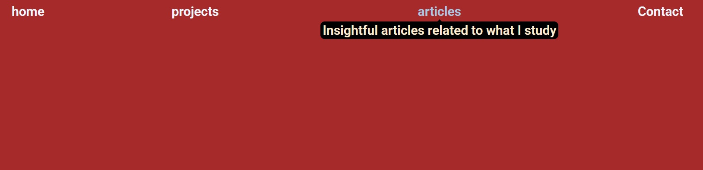

  <h1 align="center">
    Tooltip UI
  </h1>

 

# Objective
Create a tooltip that appears above navigation items when hovered, using only HTML and CSS.
 
I decided to make the tooltip appear below the items, for components purpose (simulate a header navbar).
 
 

# README
https://roadmap.sh/projects/tooltip-ui
 
 

# PREVIEW

# EXTRA FEATURES
<ul>
  <li>Added color transition when hovering the link</li>
  <li>Added opacity transition for the tooltip text</li>
</ul>
 

# Auxiliary Resources
<ul>
  <li>
    <a href="https://www.w3schools.com/css/css_tooltip.asp" alt=W3 schools - CSS Tooltip">W3 schools - CSS Tooltip</a>
  </li>
  <li>
    <a href="https://www.w3schools.com/cssref/css3_pr_transition.php" alt=W3 schools - CSS transition Property">W3 schools - CSS transition Property</a>
  </li>
</ul>
